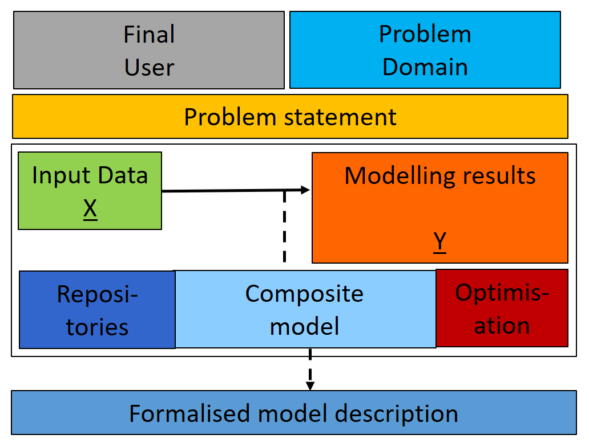
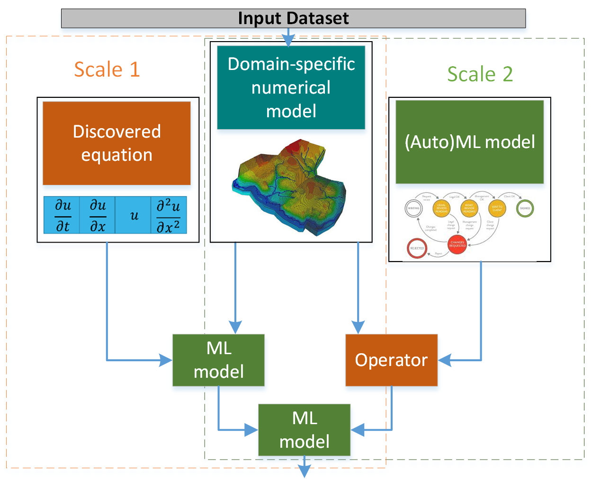

## Composite models

Composite model is a heterogeneous model that consists of several heterogeneous models [1]. The structure of the composite model usually can be represented as a oriented acyclic graph (DAG).
A special case of this structure is an ensemble of models (can be single or multi-level).

## Formalisation

The structure of the composite model can be represented as a chain C, which consists of a set of various machine learning models  M = \{ M_1, ..., M_n \}  and a directed link between them  L = \{ L_1, ..., L_k \} .

Each link L represents the data flow from the output of model M_i to one of the M_j inputs. 
The model M_j can receive several data flows, so its output can be represented as Y_j=M_j(M_{i1},...M_{ik}). The initial (primary) models in the chain are initialized by input data X directly. Also, each model M_i is initialized by a set of hyperparameters P_{i}. The structure of the chain C(M, L, P) can be represented as a directed acyclic graph (DAG), where the vertices correspond to models M and the edges correspond to links L.

## Multi-scale models

The submodel of composite model can represent different scales of the target process

[1] Kovalchuk, S.V., Metsker, O.G., Funkner, A.A., Kisliakovskii, I.O., Nikitin, N.O., Kalyuzhnaya, A.V., Vaganov, D.A., Bochenina, K.O., 2018.252A conceptual approach to complex model management with generalized modelling patterns and evolutionary identification. Complexity 2018
