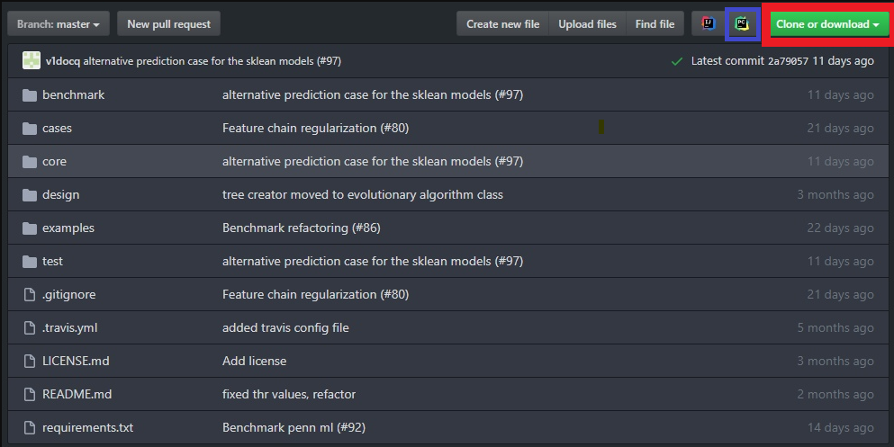

## FEDOT Framework quick start guide

## How to create your own composite model in manual way:
 
* **Step 1**. Specify problem type and choose dataset.
```python
task = Task(TaskTypesEnum.classification)
dataset_to_compose = InputData.from_csv(train_file_path, task=task)
dataset_to_validate = InputData.from_csv(test_file_path, task=task)
```
* **Step 2**. Create *Chain* instance, create nodes with desired models
```python
chain = Chain()
node_first = NodeGenerator.primary_node(ModelTypesIdsEnum.linear)
node_second= NodeGenerator.primary_node(ModelTypesIdsEnum.xgboost)
node_final = NodeGenerator.secondary_node(ModelTypesIdsEnum.knn)
chain.add_node(node_final)
```
* **Step 3**. Fit the chain using *fit* method.
```python
chain.fit(input_data=dataset_to_compose)
```
* **Step 4**. Obtain the prediction using *predict* method.
```python
prediction = chain.predict(dataset_to_validate)
```

## How to compose the chain in automated way:
```python
models_repo = ModelTypesRepository()
available_model_types, _ = models_repo.search_models(
    desired_metainfo=ModelMetaInfoTemplate(input_types=[DataTypesEnum.table],
                                           task_type=[TaskTypesEnum.classification,
                                                      TaskTypesEnum.clustering]))

composer_requirements = GPComposerRequirements(
        primary=available_model_types,
        secondary=available_model_types)

metric_function = MetricsRepository().metric_by_id(ClassificationMetricsEnum.ROCAUC)

chain_evo_composed = composer.compose_chain(data=dataset_to_compose,
                                            composer_requirements=composer_requirements,
                                            metrics=metric_function)
```

## How to install Fedot to your system:

* **Step 1**. *Download FEDOT Framework*.
  * First of all, you need to copy or 'download' FEDOT Framework to your personal computer. You can do it directly using the button          'clone or download' (red square) or you can install 'Jetbrains toolbox' and using the "clone in Pycharm" button (blue square), 
    which will open the files you need directly in the Pycharm project. 
  * For more details, see a picture below.
    * 
* **Step 2**. *Creating VirtualEnv in Pycharm project*.
  * Next, you need to create virtual enviroment in your Pycharm project. To do this, go through the following chain: 
    *'File-Settings-Project Interprenter-Add new'*. 
  * For more details, see a picture below.
    * 
  * After you have created a virtual environment, you should install the libraries necessary for the FEDOT framework to work. 
    In order to do this, go to the terminal console (blue square) and run the following command *pip install -r requirements.txt* 
    (red square). 
  * For more details, see a picture below.
    * 
* **Step 3**. *Manually installing libraries*.
  * In order to use the framework visualization tools, you will additionally need to manually install the graphviz library.
    * Download "graphviz-2.38.msi" from https://graphviz.gitlab.io/_pages/Download/Download_windows.html
    * Execute the "graphviz-2.38.msi" file
    * Add the graphviz bin folder to the PATH (blue square) system environment variable (Example: "C:\Graphviz2.38\bin") (red square) 
  * For more details, see a picture below.
    * 
    


